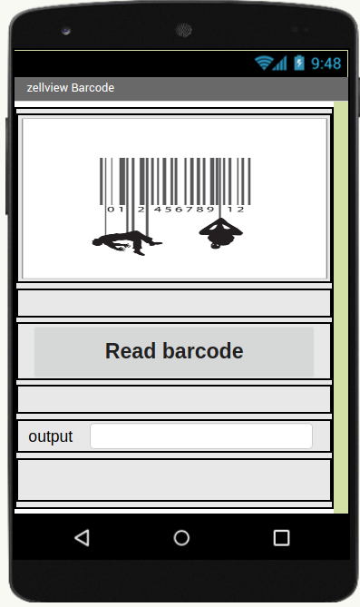

## zellviewbarcode

is a simple android-app written in Blockly for [AppInventor2](http://ai2.appinventor.mit.edu)
showing the use of barcodereader.

You can download the project-file .aia [here](https://github.com/zellview/barcode/blob/master/barcode.aia)

and the install file .apk [here](https://github.com/zellview/barcode/blob/master/barcode.apk)

You will need [companion app](https://play.google.com/store/apps/details?id=edu.mit.appinventor.aicompanion3&hl=de)
on your android-phone.

## enjoy and happy coding

